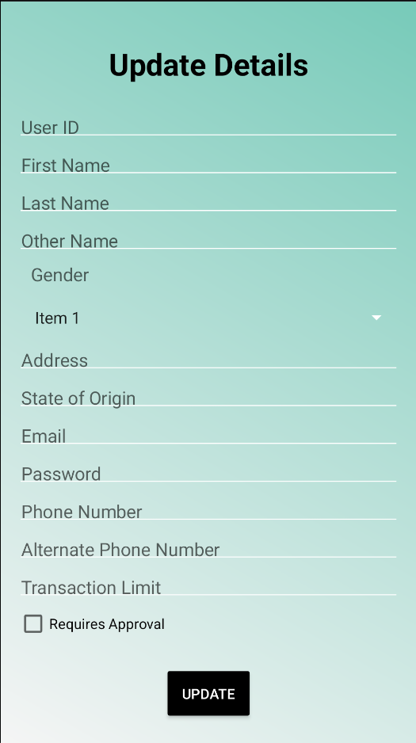
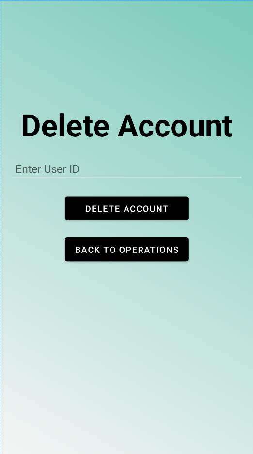
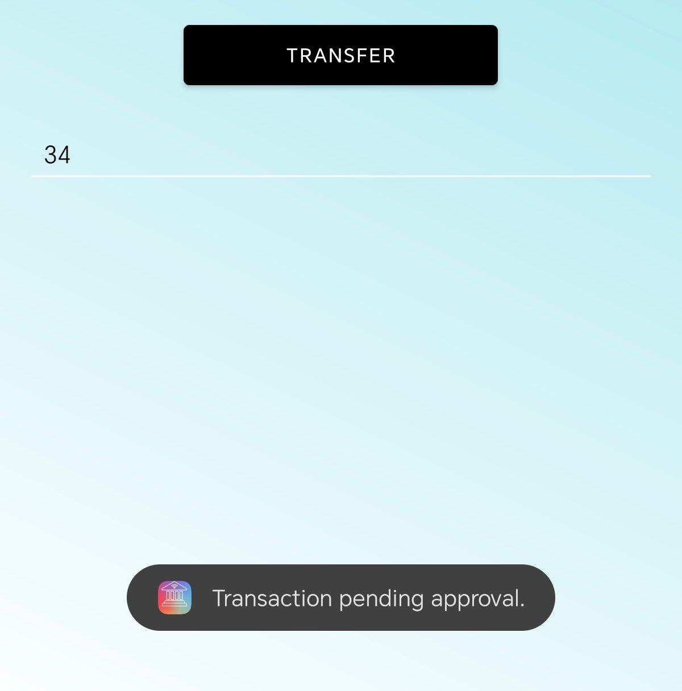

# SecureBank

SecureBank is a comprehensive banking application built with Spring Boot and Maven for the backend and an Android native app for the frontend. The system provides all the basic CRUD functionalities, along with approval/rejection features for transaction limits.

## Table of Contents
1. [Project Overview](#project-overview)
2. [Features](#features)
3. [Security](#security)
4. [Screenshots](#screenshots)
5. [Backend Setup](#backend-setup)
6. [Frontend Setup](#frontend-setup)
7. [Error Handling](#error-handling)
8. [Technologies Used](#technologies-used)

## Project Overview

SecureBank is a banking application built with a Spring Boot backend and a native Android frontend. It provides various banking services including CRUD operations, transaction approval/rejection, and email notifications. The backend is secured with JWT bearer tokens, and all API calls are integrated with Swagger UI for easy testing. The Android application communicates with the backend via Retrofit, and the entire system is designed to ensure robust security, error handling, and an interactive UI.


---

## Features
- **Basic CRUD Operations**: User management including creating, updating, retrieving, and deleting users.
- **Approval/Rejection of Transaction Limits**: Admin can approve or reject transactions based on defined limits.
- **Swagger UI Integration**: API documentation and testing interface using Swagger UI.
- **Admin & User Roles**: Different access levels for admin and regular users.
- **Spring Boot with Maven**: A Spring Boot application using Maven for efficient dependency management.
- **Spring Mail Integration**: Automatic email notifications using Spring Mail for transaction status and alerts.
- **RESTful API Architecture**: A clean, RESTful API for smooth communication between frontend and backend.
- **DAO Layer Architecture**: A structured Data Access Object (DAO) layer to handle data efficiently.
- **MySQL Database**: Persistent data storage using MySQL for all application-related data.
- **Interceptor**: Custom interceptors for request/response processing to handle specific behaviors or add extra logic.
- **Lombok Plugin**: Usage of Lombok to reduce boilerplate code and improve readability.
- **Native Android Application**: A fully functional native Android app for managing bank accounts and performing transactions.
- **Interactive UI Design**: A beautiful and engaging user interface for an enhanced user experience.
- **Retrofit Integration**: Seamless connection between the frontend and backend using Retrofit for API calls.
- **Developed with Gradle**: Built using Gradle for efficient Android development and dependency management.
- **JWT Authentication**: Secure user authentication with JWT-based security in the frontend to connect to backend APIs.
- **Responsive Design**: A responsive layout ensures smooth and consistent performance across different devices and screen sizes.
---

## Security
- **JWT Bearer Token**: All secured endpoints require a valid JWT token for authentication.
- **CSRF Protection**: Enforced to avoid Cross-Site Request Forgery attacks.
- **Exception Handling**: Proper error codes and messages are sent for each type of error.

---

## Screenshots  

#### Home Screen  
  

#### Login Page  
  

#### Registration Page  
  

#### Operations Page  
  

#### Account Details Page  
  

#### Credit Account Page  
  

#### Debit Account Page  
  

#### Transfer Account Page  
  

#### Transaction Approval Page  
  

#### Transaction Rejection Page  
  

#### Balance Enquiry Page  
  

#### Name Enquiry Page  
  

#### Update Account Page  
  

#### Delete Account Page  
  

#### Toast  
  
  
  
  

#### Database  
  

#### Swagger-UI  
  

#### Postman API Hit  
  
  

---  

## Backend Setup

### Prerequisites
- Java 8 or above
- Maven
- MySQL Database
- Spring Boot

### Running the Backend
1. Clone the repository:
   ```bash
   git clone https://github.com/harshagnihotri10/SecureBank.git

   ```
2. Navigate to the backend directory:
   ```bash
   cd SecureBank-backend
   ```
3. Configure MySQL database settings in `application.properties`:
   ```properties
   spring.datasource.url=jdbc:mysql://localhost:3306/securebank
   spring.datasource.username=root
   spring.datasource.password=<your-password>
   ```
4. Build and run the backend:
   ```bash
   mvn spring-boot:run
   ```
5. The backend will be accessible at `http://localhost:8080`.
   
6. Once the backend is running, you can access Swagger UI at: `http://localhost:8080/swagger-ui/`

---

## Frontend Setup

### Prerequisites
- Android Studio
- Gradle
- Android SDK

### Running the Frontend
1. Navigate to the backend directory:
   ```bash
   cd SecureBank-frontend
   ```
2. Open the project in Android Studio.
3. Update the base URL in the `Retrofit` client to point to your local backend (e.g., `http://<backend-ip>:8080`).
4. Connect your Android device to the same WiFi network as the backend.
5. Build and run the application.

---

## Error Handling
The backend is configured to handle exceptions gracefully with appropriate error codes and messages. If an invalid request is made or an exception occurs, a structured response with a meaningful message will be returned.

Example:
```json
{
  "error": "Invalid Credentials",
  "status": 401
}
```

---

## Technologies Used
- **Backend**: Spring Boot, Maven, MySQL
- **Frontend**: Android Native, Retrofit, Gradle
- **Security**: JWT Authentication, CSRF Protection
- **Other**: Lombok, Swagger UI, Spring Mail

---

